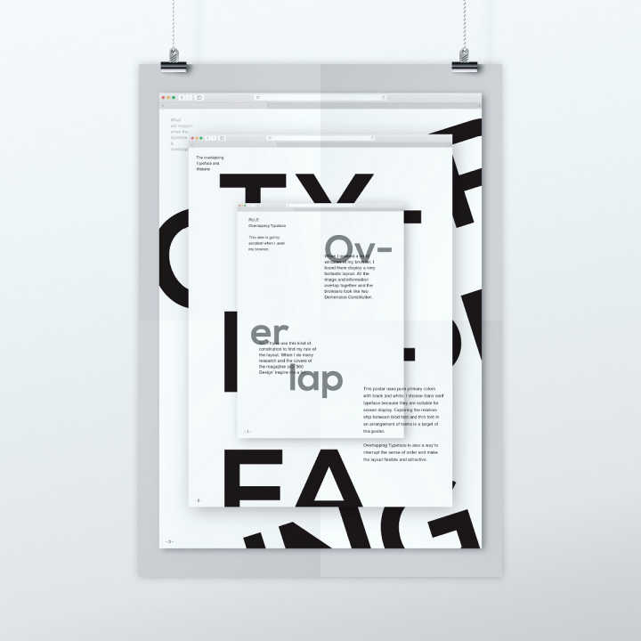
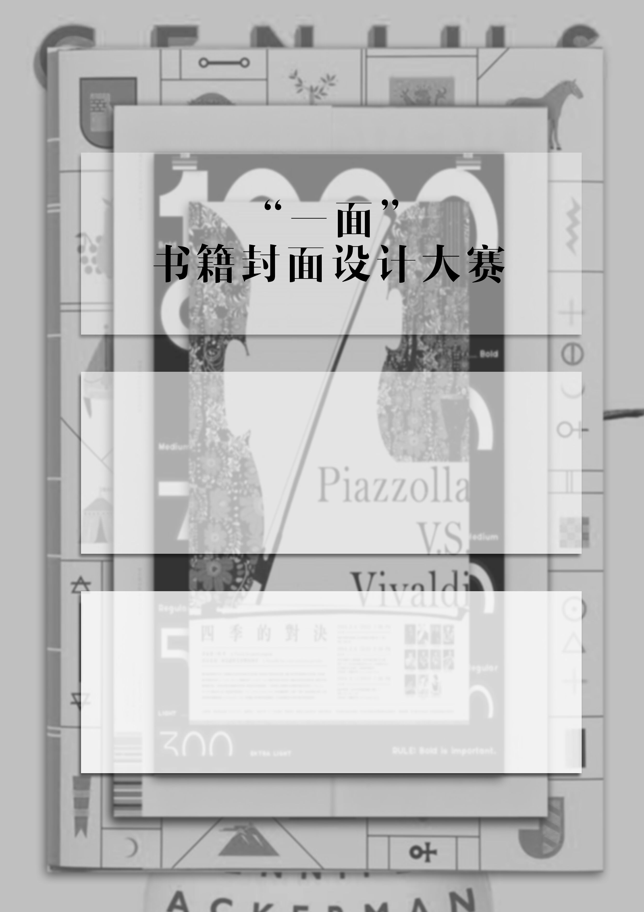
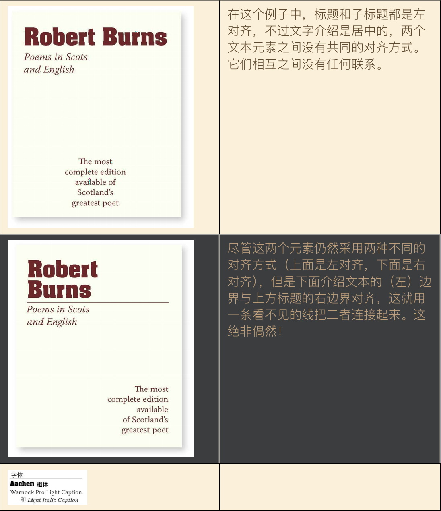
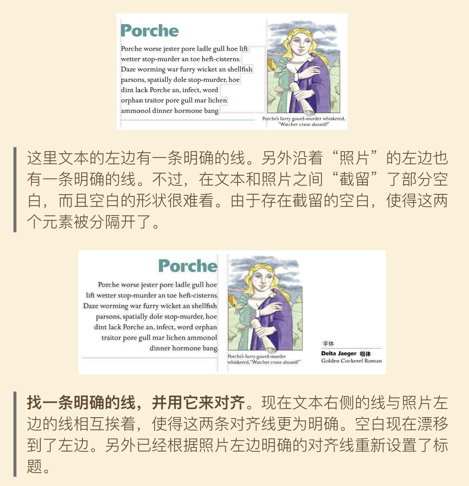
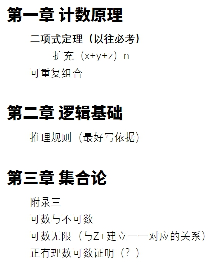
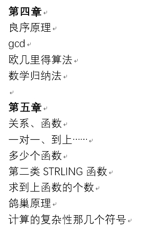

# 构图排版

---

开始正经讲设（肝）计（图）。  

## 从模仿开始  

从构图排版开始，是为了引入（我个人觉得）最重要的技巧，也是最重要的学习方法：  

从模仿你欣赏的作品开始。  

如果你不知道从哪里开始安排一张海报的排版布局，那么可以试着去找一些你觉得不错的、符合你想要做的风格的海报，观察它们的构图布局，仿一份相似的出来。多看多做之后，什么风格该怎么布局心里会有数。  

---

#### Example  

"一面"书籍封面设计大赛传单。  

要求：具有设计感。  

   
   

构图布局怎么模仿的很明显了。为了使活动标题以及活动信息对应的文字元素能在相对比较杂乱的背景上更易读，加了不同透明度的白底（这也是比较好用的技巧之一）。  

---

#### Q: 哪儿去找好的设计来学习  

推荐以下两个渠道，具体为什么不多解释，去看看就知道了。  

- Adobe旗下的设计师交流社区[Behance](https://www.behance.net)  
- 知乎自行搜索“海报”“海报设计”话题
- 知乎关注 艺术留学女流氓  

再授人以渔：

- 知乎自行搜索“国内外有哪些好的设计网站”  

---

----

## 四个基本原则

参考：

- [如何设计一张高品位高水准海报？- 刘小敏的回答](https://www.zhihu.com/question/22332149/answer/25705909)  
- [Ps海报设计？ - 艺术留学女流氓的回答](https://www.zhihu.com/question/264205310/answer/284824224)  

以上两个回答里提到的设计四大基本原则：

> **重复，对比，亲密，对齐**  

来自于《写给大家看的设计书》一书。第一个回答足以概括这本书大体内容，也足够平常使用，建议仔细看。  

刚开始试着自己布局时尽量按照这四个原则来。  

第二个回答可以看作进阶高玩版，当你不满足于用中规中矩的方式来表现“重复，对比，亲密，对齐”时，可以尝试模仿其中的一些处理方法达到想要的效果。当然这个时候可能就需要一些除了拖拽、缩放之外的Ps操作技巧了。  

---

#### 几个关键问题

以下几点为我在阅读《写给大家看的设计书》时认为受益匪浅的一些idea。

> 对比  
>
> > 对比的基本思想是：要避免页面上的元素太过相似。如果元素（字体、颜色、大小、线宽、形状、空间等）不相同，那就干脆让它们截然不同。
>
> 对齐  
>
> > - 要避免在页面上混合使用多种文本对齐方式。
> > - **要着力避免居中对齐。……有时可以有意地选择这种对齐方式，但是不要把它做为默认选择。**  
> > - 应当找一条明确的对齐线，并用它来对齐。如果有一个照片或图片（有明确的直边），可以沿着照片的这个直边与文本的平边对齐。

关于对齐，附上书里用来说明的图。  

< center class = "half" >

 

  

关于明显对比，用我上学期记的离散考点截图来做说明。

 

  

 

---

## 小结  

- 从模仿开始  
  - “一面”传单的例子  
  - 哪里可以找到好的设计  
- 四个基本原则：重复，对比，亲密，对齐  
  - 几个关键问题  
  - 离散笔记的例子  