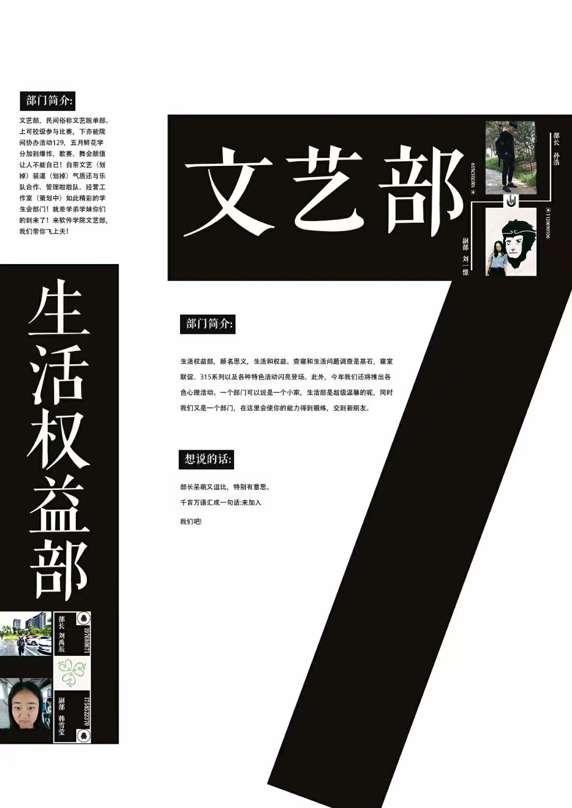

# 字体使用  

字体一般需要分成两部分来考虑：

- 标题字体  
- 正文字体  

本节最后还会对毛笔字体的使用提出一点自己的建议。  

---

### 标题字体

标题字体首先需要醒目，能和正文字体立下区别开（可以参考第二章中说的"对比"原则）。  

这种区别一般不会只从颜色上考虑，因此更重要的是字体与字号。  

下面先附几张我觉得标题字体处理得至少得当的作品。  

<figure class="third">

​	

​	

​	

</figure>

>  最右足迹宏福的海报重点关注一下“足迹宏福”这几个字的处理就好，其它字体处理会在后面的部分讲。  

这几张图对标题字体处理的共同特点：

- 没有使用黑体/宋体/楷体等“常规”字体  
- 没有使用细线条的字体  
- 字要大，至少和正文字体形成了明显的对比  
- 通过以上三点使标题在作品中的地位突出  

**总结：**关于标题字体，相应地有以下建议：

- 字要大**（强调一下仅适用于标题）**  

- 字体尽量费些心思选择

  > 哪怕是宋体，都有很多不同的宋体。这些字体大体相似，但细节上的不同可以带来很不同的视觉感受。比如示例图中“文艺部”用的字体是_方正清刻本悦宋体_。  
  >
  > 不同的宋体举例：造字工房言宋，造字工房刻宋，腾祥嘉丽宋，可以试着比较一下。  

- 标题不宜选择线条过细的字体

---

